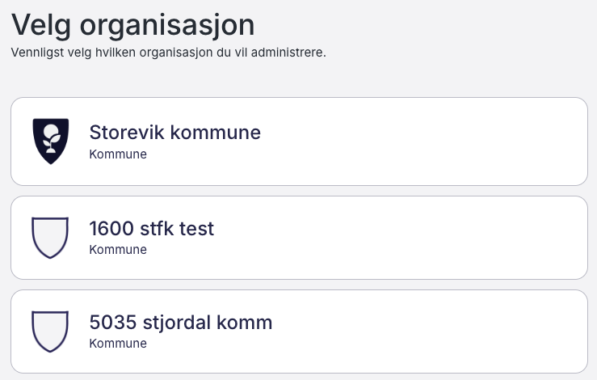

# Storevik kommune til toppen

En liten nettleserutvidelse (Chrome/Edge/Brave, Manifest V3) som flytter "Storevik kommune"
til toppen av organisasjonslisten på Fiks-forvaltning, slik at man slipper å scrolle
for å finne den.

## Installasjon (last inn som utpakket utvidelse)

1. Åpne `chrome://extensions` (eller `brave://extensions`) i nettleseren.
2. Skru på "Utviklermodus" ("Developer mode").
3. Klikk "Last inn utpakket" ("Load unpacked") og velg mappen `storevik-extension`.
4. Naviger til en av sidene nevnt over, og "Storevik kommune" skal automatisk
   flyttes til toppen av lista.
